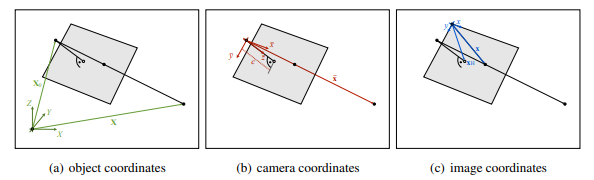
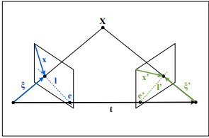
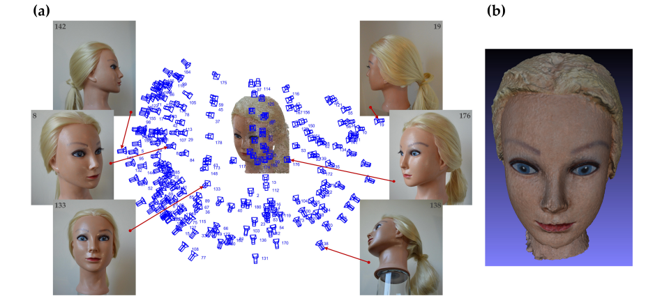

# A Técnica de Análise Fotogramétrica, Aplicações e Usabilidade
Truf Tecnologia  
Autor: Artur Azeredo Santos Servian  
Dezembro de 2024

## 1. Introdução

O princípio da Análise Fotogramétrica é utilizar um conjunto de imagens estáticas em 2D para derivar informações no mundo em 3D. São utilizadas medidas geométricas em 2D a fim de traduzir informações sobre a forma e posição de objetos no mundo real.

Possui diversas aplicações diferentes, como a área médica, construção civil, mapeamento de terrenos, reconhecimento de objetos, robótica, criação de modelos 3D para realidade virtual ou jogos.

Seu surgimento se deu quase concomitante com a criação da própria fotografia, havendo muitos estudos e aplicações consolidados ao longo de décadas. Suas principais vantagens são a alta precisão, baixo custo, aquisição rápida de dados e versatilidade.

## 2. Princípios básicos da AF

* Projeção Perspectiva: A fotogrametria geralmente usa o modelo de câmera de projeção central, que é uma boa aproximação para a formação de imagens em uma câmera convencional. Este modelo pressupõe que a luz viaja em linha reta e que todos os raios de luz que entram na câmera passam por um único ponto, chamado de centro de projeção.
* Restrição de Colinearidade: O princípio fundamental da medição fotogramétrica é a restrição de colinearidade: um ponto 3D no mundo, sua imagem na câmera e o centro de projeção da câmera devem estar todos em uma linha reta.
* Correspondências de Ponto: Para obter medidas 3D, várias imagens da mesma cena são adquiridas de diferentes pontos de vista. Pontos correspondentes, que são projeções do mesmo ponto 3D do mundo em diferentes imagens, são então identificados.
* Triangulaçã: A partir das correspondências de pontos e das orientações conhecidas da câmera, as coordenadas 3D dos pontos do objeto podem ser reconstruídas por triangulação.

## 3. Etapas de implementação

Para implementar esta análise, existem alguns procedimentos que devem ser seguidos, a fim de garantir boa confiabilidade nos resultados. É importante salientar que existem fatores estatísticos e diversos erros acumulados que vão influenciar no resultado final, portanto quanto maior a precisão individual das etapas, maior a precisão do resultado final.

### 3.1 Planejamento e aquisição de imagens

As imagens que irão compor a análise podem ser obtidas de diferentes formas, e cada uma delas deve ser levada em consideração para o objetivo final. Para terrenos, é comum a utilização de drones com câmeras acopladas, que possuem resoluções extremamente altas.

Em construções e objetos maiores, é comum a utilização de câmeras profissionais, para captar maiores detalhes e aumentar a detecção de pontos de interesse. Nestes casos, também é válida a utilização de periféricos como tripés, estabilizadores, niveladores, entre outros, para garantir que não hajam imagens ruidosas ou tremidas, e também para extrair fatores fixos importantes, como angulação da câmera em relação ao solo, que influenciará na matriz de projeção.

Entre as aplicações citadas, também é frequente o uso de mais de uma câmera, em diferentes posições, para facilitar o processo e garantir o conhecimento preciso de informações, como posição e orientação.

Vale salientar que a qualidade de imagem é um fator crucial para bons resultados na análise, e que carrega consigo um fator diretamente proporcional: o poder de processamento. Quanto maior a qualidade uma imagem, maior seu número de pixels, e por consequência, maior poder de processamento é necessário para tratar as imagens e gerar a nuvem de pontos 3D.
### 3.2 Orientação da câmera

A orientação da câmera, incluindo sua posição e orientação, é determinada para cada imagem. Isso pode ser feito usando pontos de controle terrestre com coordenadas 3D conhecidas ou por meio de orientação relativa, onde a orientação de uma câmera é determinada em relação à outra

Para uma única imagem, pelo menos seis pontos de controle terrestre são necessários para determinar a orientação completa, que inclui orientação interior (parâmetros internos da câmera) e orientação exterior (posição e orientação da câmera). Um método algébrico chamado Transformação Linear Direta (DLT) pode ser usado para calcular a matriz de projeção da câmera a partir de pontos de controle terrestre e seus pontos de imagem correspondentes.
A orientação relativa de duas imagens pode ser determinada usando a restrição de coplanaridade, que afirma que os raios de visão por meio de pontos de imagem correspondentes devem ser coplanares. A matriz fundamental, que descreve a orientação relativa de duas câmeras, pode ser estimada a partir de pontos de imagem correspondentes.
Para redes de múltiplas imagens, as orientações relativas de pares de imagens podem ser encadeadas para obter a orientação de todas as imagens em um sistema de coordenadas comum. Esse procedimento pode ser refinado usando o ajuste de feixe, um método de mínimos quadrados que otimiza todos os parâmetros de orientação simultaneamente.

### 3.3 Correspondência de Pontos

Algoritmos da análise fotogramétrica identificam pontos correspondentes, que são projeções do mesmo ponto de objeto 3D. Usualmente, recursos como o SIFT (Scale-Invariant Feature Transform) ou SURF (Scale-Invariant Feature Transform) são utilizados para esta finalidade.
Em análises cujo o objeto em questão não possui texturas bem definidas, como o exemplo de interior de tubos, um esquema chamado Grid Motion Statistics (GMS) pode ser mais eficaz [5]. O GMS identifica correspondências analisando regiões em vez de pontos, com base no princípio de suavização de movimento.

### 3.4 Triangulação

Uma vez que as orientações da câmera são conhecidas, as coordenadas 3D dos pontos de objeto podem ser determinadas por triangulação, na qual soluções algébricas e iterativas são utilizadas. Isso envolve encontrar a interseção dos raios de visão dos pontos de imagem correspondentes. 

O processo se baseia no princípio de que cada ponto em uma imagem representa um raio de luz que se originou no ponto 3D correspondente na cena e passou pelo centro óptico da câmera.
Ao observar o mesmo ponto em múltiplas imagens, obtemos múltiplos raios que, idealmente, se intersectam no ponto 3D. Essa interseção define a localização do ponto no espaço tridimensional. Matematicamente, a triangulação pode ser formulada como um problema de encontrar o ponto 3D que satisfaz a condição de coplanaridade. Essa condição afirma que o ponto 3D, juntamente com os centros ópticos das câmeras que o observam, devem estar todos no mesmo plano, atendendo à chamada Condição de Coplanaridade [7], que é resolvida por um sistema de equações.

### 3.5 Geração do modelo 3D

Por fim, de posse de todo o desenvolvimento, é gerada uma nuvem ou malha 3D, a partir dos pontos 3D reconstruídos. Então é possível criar diferentes soluções, como modelos de elevação digital e ortomosaicos. 

## 4 Desafios e limitações

Diversos parâmetros devem ser levados em consideração para bons resultados neste tipo de análise, alguns deles, inclusive, devem ser quantificados pois entram em equações importantes, sendo uma delas a Matriz de Projeção (P) [7].

P = [M|m] = [KR] - [KRXe0] 

Alguns dos parâmetros que podemos elencar, são:
* Qualidade da imagem: fatores como ruídos, desfoque, distorções e tremores comprometem muito a análise e devem ser mitigados;
* Correspondência de pontos: Identificar pontos correspondentes de forma confiável em imagens com texturas repetitivas ou fracas pode ser desafiador;
* Oclusão: Quando os objetos são ocultados uns pelos outros nas imagens, pode ser difícil reconstruir sua geometria completa;
* Calibração: Algoritmos e softwares de calibração são comumente usados para padronização das imagens.

A fotogrametria e a visão computacional são campos intimamente relacionados que compartilham muitos objetivos e técnicas. No entanto, a fotogrametria tradicionalmente se concentra na precisão geométrica, enquanto a visão computacional frequentemente prioriza o reconhecimento de objetos e a compreensão da cena.

### 4.1 Uso de câmeras de _Smartphones_

Em específico, existe o interesse em utilizar câmeras de _Smartphones_ para realizar Análises Fotogramétricas, devido a sua ampla difusão, fácil manuseio, baixo custo e aumento da qualidade de imagem gerada nos últimos anos, com a evolução da tecnologia.

Todas as especificidades, parâmetros e requisitos anteriores também	são válidos para a aplicação da AF com câmeras de _Smartphones_, e, devido a sua inconstestável inferioridade em relação a outras opções de câmeras, alguns deles se fazem ainda mais rigorosos. Para isso, existem algumas recomendações a fim de não comprometer os resultados.

A presença de texturas mais ricas facilita o processo de reconhecimento de pontos, portanto não é recomendado o uso das câmeras de _Smartphones_ em texturas lisas ou simples. Uma boa iluminação é fundamental, evite condições de pouca luz, elas geram granulação, disfoque de movimento e distorção no obturador. Se possível, utilizar um plano de fundo neutro e estático. A variabilidade de imagens é importante, assim, o maior número possível de imagens com ângulos diferentes ajuda a garantir bons resultados, com sobreposição suficiente entre as imagens; para isso, o processo de gravar um vídeo e abstrair frames dele pode ser interessante. Nas configurações da câmera, utilize a máxima resolução disponível, distância focal fixa e estabilização de imagem desativada, pois pode levar a distorções variáveis e geometria interna instável da câmera. No pré-processamento, é possível melhorar a qualidade das imagens usando técnicas de desfoque e correção de cores.
Determine a orientação da câmera para cada imagem usando pontos de controle terrestre (se disponível) ou por meio de orientação relativa.
As câmeras de smartphone podem introduzir distorções significativas da lente nas imagens. Essas distorções precisam ser corrigidas durante o pré-processamento para obter resultados precisos.

Uma importante restrição é a de que a fotogrametria baseada em _Smartphone_ é mais adequada para aplicações de curto alcance onde alta precisão não é crítica.

## 5. Considerações Finais

A Análise Fotogramétrica é uma técnica com diferentes abordagens, aplicações e usos, além de possuir vasto apoio bibliográfico e difusão. 
A possibilidade de recriar um ambiente real virtualmente, com alta fidelidade geométrica, através de imagens estáticas, torna a AF extremamente útil nos mais vastos campos do conhecimento, desde a construção civil e arqueologia até a arte, com criação de filmes e jogos. 

Seu uso para estimação de distâncias e profundidade ainda não foi bem desenhado ou explorado, não havendo disponíveis pesquisas acadêmicas para este fim usando câmeras de _Smartphones_. Tais câmeras, que, por sua vez, possuem diversas limitações, mesmo que seja o gadget mais difundido mundialmente, de fácil acesso, ainda não consegue trazer resultados tão eficientes como ferramentas mais apropriadas e robustas, como câmeras profissionais com lentes específicas e aparato periférico como tripés, _gimbal_, entre outros.

Além disso, a necessidade de acesso à informações do aparelho e configurações específicas das opções de fotografia trazem a necessidade de um usuário apto para realizar tais configurações. Desta forma, a AF é uma tecnologia complexa de se implementar em camadas mais obscuras de uma aplicação. 
Mais ainda, para o caso da aplicação de Liveness, onde o processamento ocorre no aparelho do usuário, uma AF torna-se inviável, pois ela exige maior poder de processamento do que uma solução de Visão Computacional comum.

## Referências Bibliográficas

[1] Matuzevičius, D.; Serackis, A. Three-Dimensional Human Head Reconstruction Using Smartphone-Based Close-Range Video Photogrammetry. *Appl. Sci.* 202, *12*, 229  
[2]  Mundy, J.L.; Zisserman, A.  Towards a new framework for vision. *Proc. DARPA Image Understanding Workshop*. 1992  
[3] Elias, M.; Maas, H.-G.  Investigation on Multi-Sensor Fusion Strategies for Improved Orientation Determination in Mobile Phone Imaging Applications. *ISPRS Ann. Photogramm. Remote Sens. Spatial Inf. Sci.* ,202, *V-1-2020*, 181–188  
[4] McGlone J.C. (ed.). *Manual of Photogrammetry*. American Society for Photogrammetry and Remote Sensing, Bethesda, Maryland, USA, 6th edition, 2013  
[5] Xu, Z.; Lu, X.; Wang, W.; Xu, E.; Qin, R.; Niu, Y.; Qiao, X.; Yang, F.; Yan, R. Monocular Video Frame Optimization Through Feature-Based Parallax Analysis for 3D Pipe Reconstruction. *Photogramm. Eng. Remote Sens.* 202, *87* (1), 55–64  
[6] Patonis, P. A Comparative Study on the Use of Smartphone Cameras in Photogrammetry Applications. *Sensors* 202, *24*, 7311  
[7] SCHINDLER, Konrad. Mathematical Foundations of Photogrammetry